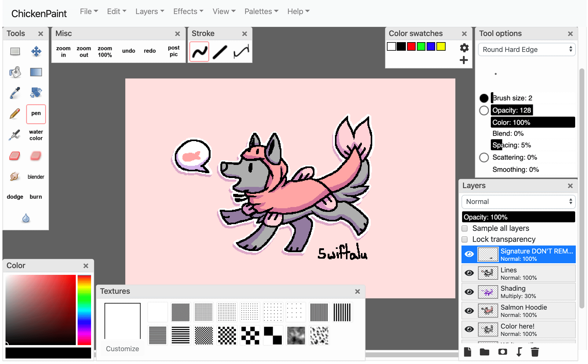

# ChickenPaint

ChickenPaint is an HTML5 port of Marc Schefer's excellent multi-layer drawing Oekaki Java applet
[ChibiPaint](https://github.com/thenickdude/chibipaint). I decided to port it to JavaScript because Java applet support in browsers 
has been dropping continuously, while JavaScript support continues to strengthen. Like the original, it is licensed
under GPLv3.



The artwork being edited here is ["Woof Woof"](http://www.chickensmoothie.com/Forum/viewtopic.php?t=3079211) by [Swiftalu](http://www.chickensmoothie.com/Forum/memberlist.php?mode=viewprofile&u=91654).
You can color-in to create your own version of this drawing using ChickenPaint [on Chicken Smoothie](http://www.chickensmoothie.com/Forum/viewtopic.php?t=3079211)!

## Features

- A wide variety of brushes
- Multiple layers and 15 Photoshop-style layer blending modes
- Rotating canvas, work at any angle!
- Tablet pen pressure support (see notes below)
- Keyboard shortcuts
- New gradient fill tool
- New free-transform feature (rotate, scale, stretch)
- Clipping mask for layers
- Layer masks
- Layer groups

## Supported browsers
ChickenPaint is supported in IE10 and 11, Edge, Chrome, Safari, Firefox and Opera, though it runs fastest in Chrome.

Tablet pressure support by Wacom plugin is available for browsers that still support NPAPI plugins (IE 10, IE 11,
Firefox 32-bit, Safari and Opera).

Native pen pressure support via Pointer Events is available for IE, Edge, Firefox and Chrome on Windows 8 and 10 (Windows 7 does not 
support it), and macOS.

In Firefox on Windows, you may need to set `dom.w3c_pointer_events.dispatch_by_pointer_messages` to `true` in [about:config]()
to get pen pressure support working.

## Try it out online
ChickenPaint is used as the default painting tool on [Chicken Smoothie's Oekaki forum](http://www.chickensmoothie.com/Forum/viewforum.php?f=29)
if you're using the Google Chrome or Microsoft Edge web browsers (a free account is required).

You can try it without an account [on the ChickenPaint Integration Example page](https://thenickdude.github.io/chickenpaint-example/),
which shows how ChickenPaint can be fetched using NPM and loaded into your page.

## Building
Building ChickenPaint requires [Node](https://nodejs.org/en/) to be installed (I'm using v10 LTS) along with GNU Make.

In the root of ChickenPaint, run `npm install` to install required dependencies. 

One of the development dependencies is `node-canvas`, which has some required system packages like `libcairo2`. 
[Check out the full list of packages on their site](https://github.com/Automattic/node-canvas). You'll need to install 
these for `npm install` to succeed.

Then run `make all` to build ChickenPaint.
The resulting `chickenpaint.js` file will be written to `resources/js`, and `chickenpaint.css` will be written to `resources/css`.
You can use `make min` to build a minified version.

## Running locally
Run `npm start` to start a local webserver for testing. Open the resulting link in your browser and the `example/index.html` 
page should open.

For testing the PHP image upload example `example/save.php` you can run `php -S 127.0.0.1:5000` in the root of this package 
instead. Then browse to `http://localhost:5000/example/` and you should be able to "post" your drawing, where it'll be
saved as `uploaded.chi`/`uploaded.png`. 

To edit the saved drawing you'll need to uncomment the `loadChibiFileUrl`/`loadImageUrl`
lines in `example/index.js`.

## Usage

Include ChickenPaint's main JS and CSS files:

```html
<script src="chickenpaint/js/chickenpaint.js"></script>
<link rel="stylesheet" type="text/css" href="chickenpaint/css/chickenpaint.css">
```

Prevent zooming on mobile devices by adding this to your head:

```html
<meta name="viewport" content="width=device-width,user-scalable=no">
```

For iOS Safari support, you also need to add this to the head to block the long-press text
selection popup from appearing on your body elements (when not in ChickenPaint full-screen mode):

```html
<style>
body {
	-webkit-user-select: none; /* For iOS Safari: Prevent long-press from popping up a selection dialog on body text */
}
</style>
```

Add an element to serve as the container for ChickenPaint:

```html
<div id="chickenpaint-parent"></div>
```

Then construct ChickenPaint and tell it which DOM element to add to:

```js
new ChickenPaint({
    uiElem: document.getElementById("chickenpaint-parent"),
    saveUrl: "save.php",
    postUrl: "complete.php",
    exitUrl: "index.php",
    resourcesRoot: "chickenpaint/"
});
```

The possible options, including additional options for loading saved .chi or .png files for editing, are described
in the typedef comment for the ChickenPaintOptions object in `/js/ChickenPaint.js`.

See `/example/index.html` for a complete example of a page that hosts ChickenPaint.

Your `saveUrl` will receive the uploaded .chi layer file (if the drawing had multiple layers), flat PNG image (always)
and .aco color palette (if the user edited it), which would arrive in PHP as `$_FILES["picture"]`, `$_FILES["chibifile"]`
and `$_FILES["swatches"]`. For an example of an upload script, see `/example/save.php`.

ChickenPaint's saving workflow has been customised for use on Chicken Smoothie by setting `allowMultipleSends` to `true`
in the options in the constructor. On CS, the user can save their drawing, and then either continue editing the drawing, 
publish their completed drawing to the forum, or exit their drawing session and come back and finish it later. The 
ability to create a new drawing and then save it multiple times before publishing it to the forum effectively requires 
that the saveUrl contains a unique session ID in it. This way each `POST` to the saveUrl can be associated with the same
drawing session.

By default, `allowMultipleSends` is disabled, and the user will only have the option to post their drawing immediately.
This allows a simpler image upload script.

## Usage - NPM

You can include ChickenPaint into a larger project which already has its own Babel/Webpack/Grunt/Browserify/etc system
by installing it with NPM:

```bash
npm install --save chickenpaint
```

Then you can either load it onto the page from the node_modules folder similar to the traditional method:

```html
<script src="node_modules/chickenpaint/resources/js/chickenpaint.js"></script>
<link rel="stylesheet" type="text/css" href="node_modules/chickenpaint/resources/css/chickenpaint.css">

<script>
    document.addEventListener("DOMContentLoaded", function () {
        new ChickenPaint({
            ...
```

Or you can integrate those files into your project using your bundling framework instead:

```js
require("chickenpaint/resources/css/chickenpaint.css");

const
    ChickenPaint = require("chickenpaint");

    document.addEventListener("DOMContentLoaded", function () {
        new ChickenPaint({
            ...
```

Note that in the second case, your application will almost certainly need to be licensed GPLv3 to comply with the license
terms.